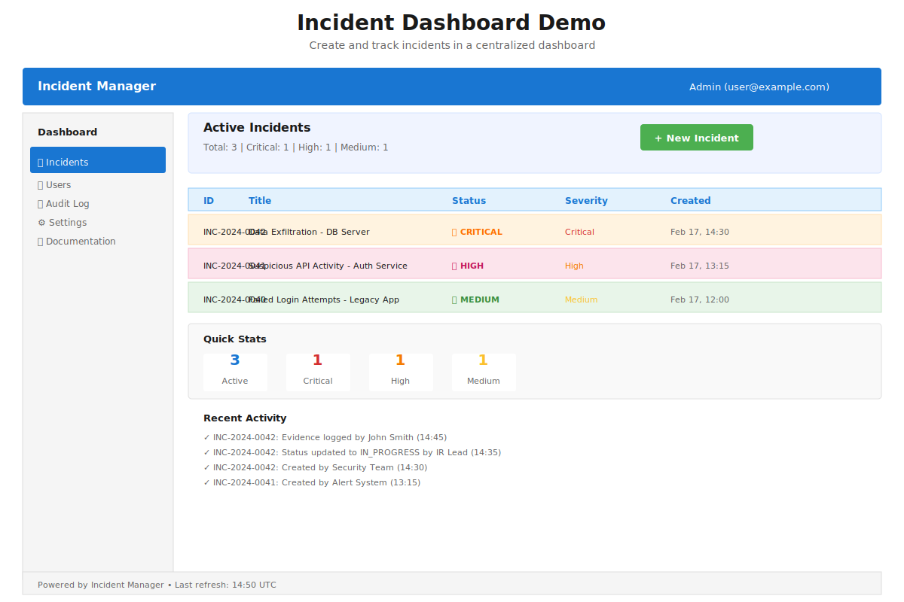
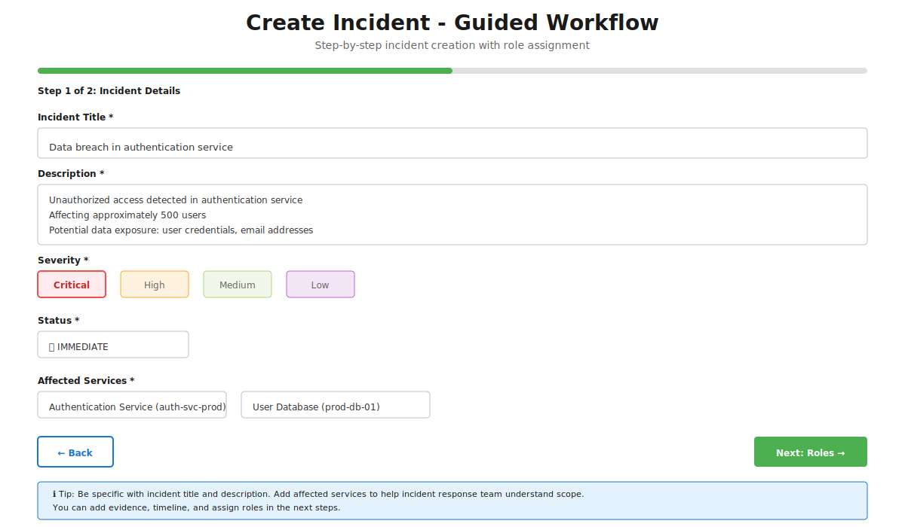

# Incident Manager (DFIR AppSec) 🛡️

**Interactive, web-based incident manager** for Digital Forensics & Incident Response (DFIR) with an **application security** focus. Built with FastAPI (backend), React (frontend), and SQLite (database).

It guides security engineers through CISO-friendly incident response stages (Immediate, Next 24–72h, Aftermath), captures evidence and timelines, manages roles and tasks, and exports clean reports for Confluence/GitHub/leadership.

## ✨ Key Features

### 🖥️ Web-Based Dashboard
- **Real-time incident overview** - List, search, filter incidents by status/severity
- **Intuitive forms** - Create and edit incidents with structured metadata
- **Role management** - Assign incident response roles (IR lead, App owner, SRE, SecOps, Comms, Legal)
- **Task tracking** - Organize tasks by phase with status tracking
- **Evidence collection** - Track evidence with optional SHA-256 hashing
- **Forensic timeline** - Build timestamped event logs (UTC ISO-8601)
- **Executive checklist** - Pre-populated CISO-friendly action items

### 📦 Deployment Options
- **Docker Compose** - Single-command standalone deployment
- **Kubernetes** - Production-ready manifests + Helm chart
  - Health probes, resource limits, security contexts
  - Network policies, RBAC, pod security standards
- **Local Development** - FastAPI dev server + React Vite

### 📤 Export Formats
- **Markdown** - Confluence-friendly, version-control friendly
- **HTML** - Standalone, email-able reports
- **PDF** - Professional reports (optional)

## 🚀 Quick Start (Docker)

```bash
git clone https://github.com/sguez/incident-manager.git
cd incident-manager

# Start all services
docker-compose up -d

# Wait for startup...
sleep 5

# Access
curl http://localhost:8000/api/docs    # API documentation
# Open http://localhost:8000 in browser # Frontend (when built)
```

**Default login:** `admin` / `change-me` (change in production!)

## 📖 Detailed Setup

### Option 1: Docker (Recommended)
See [DEPLOYMENT.md - Docker Section](DEPLOYMENT.md#docker-standalone)

### Option 2: Kubernetes
See [DEPLOYMENT.md - Kubernetes Section](DEPLOYMENT.md#kubernetes)

### Option 3: Local Development
```bash
python3 -m venv .venv && source .venv/bin/activate
pip install -r requirements.txt

# Terminal 1: Start API
uvicorn app.main:app --reload

# Terminal 2: Start frontend
cd ui && npm install && npm run dev
```

## 🏗️ Architecture


**Core Components:**
- **`app/main.py`** - FastAPI app with middleware, security headers, startup/shutdown
- **`app/security.py`** - JWT auth, RBAC decorators, input validation, audit logging
- **`app/routes/`** - API endpoints (auth, incidents, exports, users, audit)
- **`app/database.py`** - SQLAlchemy ORM with 8 tables
- **`ui/`** - React frontend with Vite, Tailwind CSS

## 📊 Product Demo

### Dashboard Overview


Real-time incident overview with severity-based filtering, role assignments, and quick actions.

### Create Incident - Guided Workflow


Step-by-step incident creation with structured metadata, severity classification, and affected systems.

### Evidence & Timeline Management


Capture and organize forensic evidence with SHA-256 verification and build comprehensive timelines with UTC timestamps.

### Export & Reports


Export incidents to Markdown (Confluence), HTML (email-ready), or PDF (executive) formats with complete audit trails.

## 🐳 Deployment Cheat Sheet

### Docker Compose
```bash
docker-compose up -d              # Start
docker-compose logs -f            # View logs
docker-compose down               # Stop & cleanup
```

### Kubernetes
```bash
kubectl apply -f k8s/deployment.yaml         # Deploy
kubectl get pods -n incident-manager          # Check status
kubectl port-forward -n incident-manager svc/incident-manager 8000:80  # Access
kubectl delete -f k8s/deployment.yaml        # Cleanup
```

### Helm
```bash
helm install incident-manager k8s/helm/       # Install
helm upgrade incident-manager k8s/helm/       # Upgrade
helm uninstall incident-manager                # Uninstall
```

See [DEPLOYMENT.md](DEPLOYMENT.md) for production checklist and advanced options.

## 📚 Documentation

| Document | Purpose |
|----------|---------|
| [**DEPLOYMENT.md**](DEPLOYMENT.md) | Docker, Kubernetes, Helm, Environment setup |
| [**API.md**](API.md) | REST API reference, cURL examples, Swagger |
| [**SECURITY.md**](SECURITY.md) | Authentication, RBAC, audit logging, hardening |
| [**.github/copilot-instructions.md**](.github/copilot-instructions.md) | Development guide for AI assistants |

## 🔐 Security Highlights

✅ **Authentication**: JWT with bcrypt password hashing  
✅ **Authorization**: 4-level RBAC (Admin, IR Lead, Viewer, Reporter)  
✅ **Audit Trail**: Every create/update/delete logged with user/IP  
✅ **Input Safety**: Pydantic validation + XSS escaping  
✅ **Output Safety**: Markdown/HTML/PDF safe character escaping  
✅ **Container**: Non-root user, read-only filesystem, dropped capabilities  
✅ **Network**: Kubernetes network policies, CORS validation  

See [SECURITY.md](SECURITY.md) for full security checklist and best practices.

## 🛠️ API Examples

### Login
```bash
curl -X POST http://localhost:8000/api/auth/login \
  -d "username=admin&password=change-me"
```

### Create Incident
```bash
curl -X POST http://localhost:8000/api/incidents \
  -H "Authorization: Bearer <TOKEN>" \
  -H "Content-Type: application/json" \
  -d '{
    "metadata": {
      "name": "Data breach detected",
      "severity": "critical",
      "classification": "data_breach",
      "reported_by": "Security Team",
      "detection_source": "WAF Alert",
      "incident_start": "2025-01-15T14:30:00Z"
    },
    "roles": [
      {"role": "ir_lead", "person": "John Doe"}
    ]
  }'
```

### Export Incident
```bash
# Markdown
curl -X POST http://localhost:8000/api/exports/1/markdown \
  -H "Authorization: Bearer <TOKEN>" -o report.md

# HTML  
curl -X POST http://localhost:8000/api/exports/1/html \
  -H "Authorization: Bearer <TOKEN>" -o report.html
```

Full API docs: **http://localhost:8000/api/docs** (Interactive Swagger UI)

## 📊 Demo

### Incident Dashboard

*Create and track incidents in a centralized dashboard*

### Creating an Incident

*Guided workflow for incident creation with role assignment*

### Evidence & Timeline

*Capture and organize evidence with forensic timeline*

### Export Report

*Export to Markdown, HTML, or PDF for stakeholders*

## 🚀 Getting Started for Developers

### Local Setup
```bash
# Backend
python3 -m venv .venv && source .venv/bin/activate
pip install -r requirements.txt

# Frontend
cd ui && npm install

# Run (2 terminals)
# Terminal 1: uvicorn app.main:app --reload
# Terminal 2: cd ui && npm run dev
```

### Project Structure
```
incident-manager/
├── app/                     # FastAPI backend
│   ├── main.py             # App factory, middleware
│   ├── security.py         # Auth, RBAC, validation
│   ├── database.py         # SQLAlchemy models
│   ├── models.py           # Pydantic schemas
│   └── routes/             # API endpoints
├── ui/                      # React frontend (Vite)
├── k8s/                     # Kubernetes manifests
├── Dockerfile              # Multi-stage build
├── docker-compose.yml
├── requirements.txt
└── README.md
```

### Running Tests
```bash
pytest tests/ -v --cov=app
```

See [.github/copilot-instructions.md](.github/copilot-instructions.md) for detailed development patterns.

## 📋 Roadmap

- [ ] PostgreSQL support for multi-instance deployments
- [ ] WebSocket support for real-time updates
- [ ] Slack/Teams integration for notifications
- [ ] Custom report templates
- [ ] Evidence encryption at rest
- [ ] OIDC/SSO integration
- [ ] Automated remediation playbooks

## 📝 License

MIT License - See [LICENSE](LICENSE)

## 🤝 Contributing

Contributions welcome! See [CONTRIBUTING.md](CONTRIBUTING.md) for guidelines.

## 📞 Support

- 📖 **Docs**: [DEPLOYMENT.md](DEPLOYMENT.md), [API.md](API.md), [SECURITY.md](SECURITY.md)
- 🐛 **Issues**: [GitHub Issues](https://github.com/sguez/incident-manager/issues)
- 💬 **Discussions**: [GitHub Discussions](https://github.com/sguez/incident-manager/discussions)

## 🙏 Acknowledgments

- Reference: [DFIR Application Security Playbook](https://blog.sguez.dev/dfir-application-security-a-practical-incident-response-playbook-for-cisos-b31fb4253782)
- Security patterns: `.claude_skills` repository
- Built with: FastAPI, React, SQLAlchemy, SQLite

---

**Made with ❤️ for security teams** | [Star us on GitHub ⭐](https://github.com/sguez/incident-manager)
